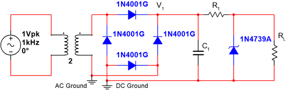
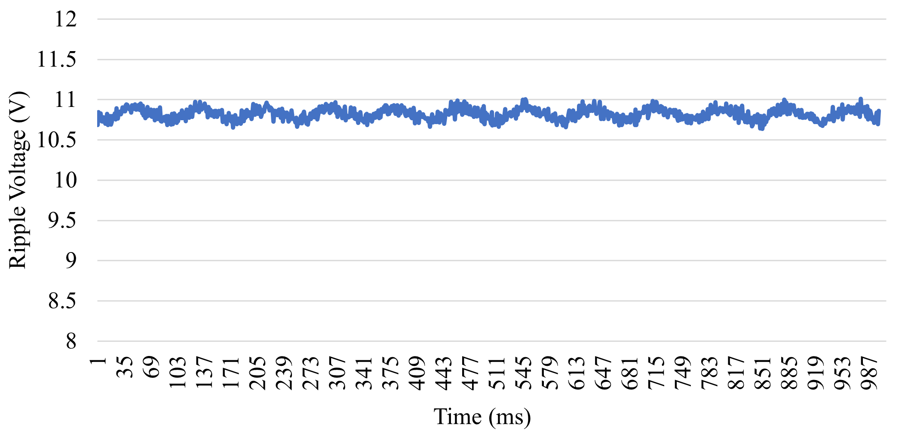
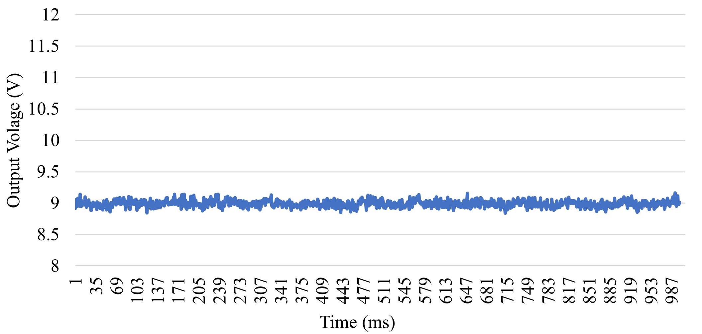

# Regulated Power Supply Design

This project presents the design, implementation, and testing of a regulated DC power supply that converts AC input into a stable DC output using rectification, filtering, and voltage regulation.

## Overview

The system converts an AC input voltage into a regulated DC output through a multi-stage design:

1. Transformer (AC voltage scaling)  
2. Full-wave bridge rectifier (AC → DC conversion)  
3. Capacitor filter (ripple reduction)  
4. Zener diode regulator (voltage stabilization)  

The design targeted a **9.1V DC output** with **less than 1V peak-to-peak ripple**.

---

## System Architecture

- Step-down transformer (14 Vrms input)  
- Full-wave bridge rectifier (1N4001 diodes)  
- Capacitor filter for smoothing  
- Zener diode (1N4739) for regulation  
- Load-dependent performance analysis  

---

## Circuit Design

The circuit converts AC input into DC and stabilizes the output using a Zener diode regulator.

---

## Ripple Reduction

The capacitor filter reduces voltage ripple, producing a smoother DC signal after rectification.

---

## Output Performance

The final output remains stable across varying load conditions, demonstrating effective voltage regulation.

---

## Key Results

- Target output: 9.1V  
- Measured output: ~8.99V  
- Ripple: < 1V peak-to-peak  
- Percent regulation: ~2.4%  

The system successfully achieved low ripple and stable operation, though slight deviation from the target voltage was observed due to non-ideal component behavior and transformer internal resistance.

---

## Files

- `docs/regulated-power-supply.pdf` — full design report and analysis  

---

## Skills Demonstrated

- Power electronics fundamentals  
- Rectification and filtering  
- Voltage regulation using Zener diodes  
- Circuit analysis and debugging  
- Experimental validation and measurement  

---

## Why This Project Matters

This project demonstrates the design of a fundamental electrical system used in nearly all electronic devices. It highlights the ability to convert and regulate power reliably while accounting for real-world non-idealities.

---

## Author

Joshua Oliveira